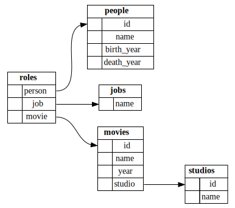

SQLite Schema Diagram Generator
===============================

A properly normalised database
can wind up with a lot of small tables
connected by a complex network of foreign key references.
Like a real-world city,
it's pretty easy to find your way around once you're familiar,
but when you first arrive it really helps to have a map.

Lots of database management tools include some kind of schema diagram view,
either automatically generated
or manually editable so you can get the layout just right.
But it's usually part of a much bigger suite of tools,
and sometimes I don't want to install a tool,
I just want to get a basic overview quickly.

What you need
-------------

  - The `sqlite3` command-line tool
  - The [sqlite-schema-diagram.sql](sqlite-schema-diagram.sql) file
    in this repository
  - The [GraphViz](https://www.graphviz.org/) graph rendering tool,
    avaliable from any Linux distro
    and a million other places besides

How it works
------------

The [sqlite-schema-diagram.sql](sqlite-schema-diagram.sql) file
contains a query which returns a sequence of strings,
representing a SQLite database's schema in GraphViz format.
You can save it to a file,
or just pipe it to the GraphViz `dot` command
to convert it to your favourite output format: PNG, SVG, PDF, whatever.

    sqlite3 path/to/database.db -init sqlite-schema-diagram.sql "" > schema.dot
    dot -Tsvg schema.dot > schema.svg

**Note:** `sqlite3` is invoked with the `-init` option
that tells it to read a file at startup,
and an empty query string that makes it start up in non-interactive mode.
That turns off any extra output formatting `sqlite3` might do
that would interfere with the GraphViz syntax.

An example
----------

In the [example/](./example/) directory,
you'll find:

  - An [SQL file](./example/schema.sql) defining a database schema
  - A [Makefile](./example/Makefile) that loads it into an SQLite database
    and generates a schema diagram
  - The [generated schema diagram](./example/schema.svg)
    (also at the top of this README)
